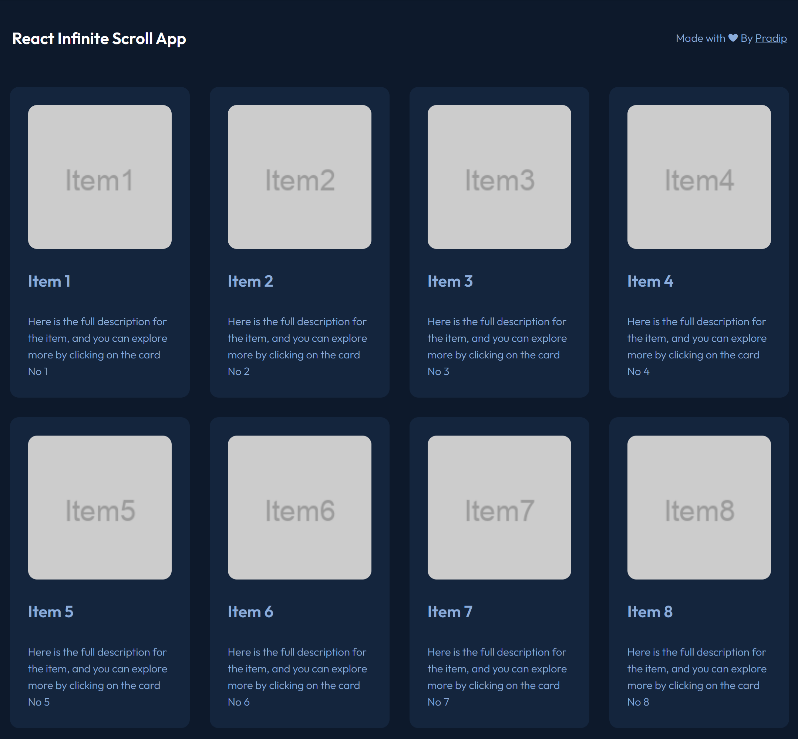

# Infinite Scroll App



## Table of Contents

1. [Introduction](#introduction)
2. [Getting Started](#getting-started)
   - [Prerequisites](#prerequisites)
   - [Installation](#installation)
3. [Running the Application](#running-the-application)
4. [Features](#features)
5. [Technologies Used](#technologies-used)

## Introduction

This is a React application that demonstrates infinite scrolling to load more items as you scroll down the page. It also allows you to view details of each item by clicking on it.

## Getting Started

### Prerequisites

Before running the application, ensure you have the following software installed on your computer:

- Node.js: [Download and Install Node.js](https://nodejs.org/)

### Installation

Clone the repository to your local machine:

   ```
   git clone https://github.com/your-username/infinite-scroll-app.git
   ```

#### Navigate to the project directory:

    cd infinite-scroll-app

#### Install the required dependencies:

    npm install

## Running the Application

#### Start the development server:

    npm start

## Features

 Enjoy endless content with our infinite scrolling feature. As you scroll down, more items seamlessly load, providing an uninterrupted browsing experience.

## Technologies Used

    - React
    - Javascript
    - Html5
    - Css3
